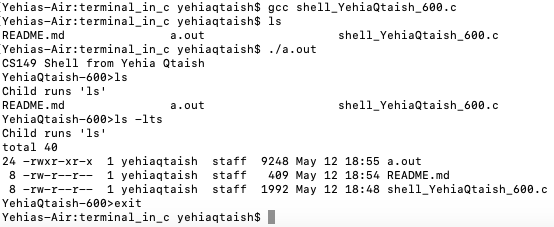

## Shell Program Using C

Simple shell application to understand how the terminal execute operating system commands..

The program using some of the main function c provides such as Malloc(), fgets(), fork(), execvp().

The project helped expand my knowledge on how processes are forked and allocated.

The way to run this program is to run the simple command on a linux machine with gcc compiler installed

